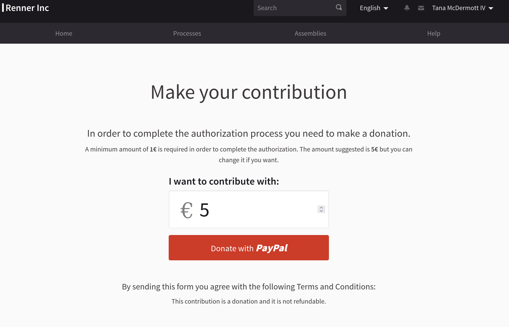

# Decidim::Donations

[![[CI] Test](https://github.com/decidiamo/decidim-module-donations/actions/workflows/test.yml/badge.svg)](https://github.com/decidiamo/decidim-module-donations/actions/workflows/test.yml)
[](https://codeclimate.com/github/decidiamo/decidim-module-donations/maintainability)
[](https://codecov.io/gh/decidiamo/decidim-module-donations)

A plugin to allow donations and verify users with them. 

Currently supports PayPal Express Checkout but more payment methods can be easily added (feel free to make contributions in this regard).



## Installation

As this is still in Beta, add this line to your application's Gemfile for now:

```ruby
gem "decidim-donations", git: "https://github.com/decidiamo/decidim-module-donations"
```

And then execute:

```bash
bundle
rails db:migrate
```

## Configuration

You need to configure the payment gateway credentials and create an initializer for adding the "Donations" verification method. In the same initializer you can setup the minim and defaults amount required.

For instance, create the file `config/initializers/decidim_donations.rb` with this content:

```ruby
# frozen_string_literal: true

# Register the verification method in Decidim so organizations can use it (remember to activate it in the /system admin panel)
Decidim::Verifications.register_workflow(:donations) do |workflow|
  workflow.engine = Decidim::Donations::Verification::Engine
  workflow.admin_engine = Decidim::Donations::Verification::AdminEngine

  # Next is optional (defaults to Non-renewable)
  workflow.expires_in = 1.year
  workflow.renewable = true
  workflow.time_between_renewals = 1.month
end

Decidim::Donations.configure do |config|
  config.minimum_amount = 1
  config.default_amount = 5

  config.provider = :paypal_express # currently only this one supported
  config.credentials = {
    login: Rails.application.secrets.donations[:login],
    password: Rails.application.secrets.donations[:password],
    signature: Rails.application.secrets.donations[:signature]
  }

  # configure a custom I18n key with an HTML text of your choosing
  # set it to an empty string to avoid showing any text
  config.terms_and_conditions = "decidim.donations.terms_and_conditions"
end
```

In the configuration above, we use the `config/secrets.yml` (but that's up to you if you want to do the same) configured as follows:

```yaml
default: &default
  ...other stuff...
  donations:
    login: <%= ENV["PAYPAL_LOGIN"] %>
    password: <%= ENV["PAYPAL_PASSWORD"] %>
    signature: <%= ENV["PAYPAL_SIGNATURE"] %>

```

Then just provide the app with the proper ENV vars.

> Note: the example above the gateway configuration is for PayPal Express Checkout. You can test it by creating a Sandbox Account in https://developer.paypal.com/developer/applications/ (Go to "Accounts" => "New account (type Business)" => "... Details" => "API Credentials" )
> 
> For real usage, create a NVP/SOAP real PayPal "Business" account.

## Usage

For enabling the verifcation method:

- Follow the installation instructions above.
- Login to the system management section of Decidim at `/system`.
- Enable the newly added verification method ("Donations").

TODO


## Contributing

See [Decidim](https://github.com/decidim/decidim).

### Developing

To start contributing to this project, first:

- Install the basic dependencies (such as Ruby and PostgreSQL)
- Clone this repository

Decidim's main repository also provides a Docker configuration file if you
prefer to use Docker instead of installing the dependencies locally on your
machine.

You can create the development app by running the following commands after
cloning this project:

```bash
$ bundle
$ DATABASE_USERNAME=<username> DATABASE_PASSWORD=<password> bundle exec rake development_app
```

Note that the database user has to have rights to create and drop a database in
order to create the dummy test app database.

Then to test how the module works in Decidim, start the development server:

```bash
$ cd development_app
$ DATABASE_USERNAME=<username> DATABASE_PASSWORD=<password> bundle exec rails s
```

In case you are using [rbenv](https://github.com/rbenv/rbenv) and have the
[rbenv-vars](https://github.com/rbenv/rbenv-vars) plugin installed for it, you
can add the environment variables to the root directory of the project in a file
named `.rbenv-vars`. If these are defined for the environment, you can omit
defining these in the commands shown above.

#### Code Styling

Please follow the code styling defined by the different linters that ensure we
are all talking with the same language collaborating on the same project. This
project is set to follow the same rules that Decidim itself follows.

[Rubocop](https://rubocop.readthedocs.io/) linter is used for the Ruby language.

You can run the code styling checks by running the following commands from the
console:

```
$ bundle exec rubocop
```

To ease up following the style guide, you should install the plugin to your
favorite editor, such as:

- Atom - [linter-rubocop](https://atom.io/packages/linter-rubocop)
- Sublime Text - [Sublime RuboCop](https://github.com/pderichs/sublime_rubocop)
- Visual Studio Code - [Rubocop for Visual Studio Code](https://github.com/misogi/vscode-ruby-rubocop)

### Testing

To run the tests run the following in the gem development path:

```bash
$ bundle
$ DATABASE_USERNAME=<username> DATABASE_PASSWORD=<password> bundle exec rake test_app
$ DATABASE_USERNAME=<username> DATABASE_PASSWORD=<password> bundle exec rspec
```

Note that the database user has to have rights to create and drop a database in
order to create the dummy test app database.

In case you are using [rbenv](https://github.com/rbenv/rbenv) and have the
[rbenv-vars](https://github.com/rbenv/rbenv-vars) plugin installed for it, you
can add these environment variables to the root directory of the project in a
file named `.rbenv-vars`. In this case, you can omit defining these in the
commands shown above.

### Test code coverage

If you want to generate the code coverage report for the tests, you can use
the `SIMPLECOV=1` environment variable in the rspec command as follows:

```bash
$ SIMPLECOV=1 bundle exec rspec
```

This will generate a folder named `coverage` in the project root which contains
the code coverage report.

### Localization

If you would like to see this module in your own language, you can help with its
translation at Crowdin:

https://crowdin.com/project/decidim-module-donations

## License

See [LICENSE-AGPLv3.txt](LICENSE-AGPLv3.txt).
